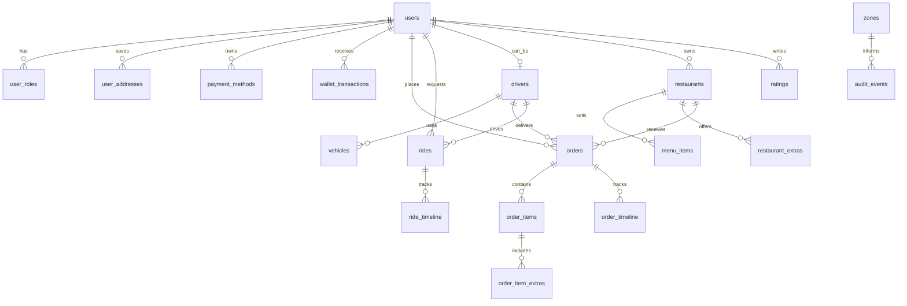

# Arquitectura de producto

Flash Delivery Mobility esta organizada como una plataforma multirol:

- Cliente: comida, taxi, actividad, wallet y perfil.
- Comercio: cocina, stock, estado operativo y alta de productos.
- Driver: conductor y repartidor en la misma app.
- Ops: operaciones, soporte, metricas y control de estados.

## Stack actual

- Frontend: React, Vite, TypeScript y CSS responsive. React e iconografía se
  publican como chunks cacheables separados; `test:web-bundle-budget` limita el
  entry propio a 560 KiB y toda la carga JavaScript inicial a 850 KiB. El
  presupuesto evita regresiones, pero no sustituye mediciones Core Web Vitals
  sobre dispositivos y redes reales.
- Express comprime respuestas elegibles mayores a 1 KiB. Los assets con hash se
  cachean como `immutable` durante un año, mientras `index.html` siempre
  revalida. El stream SSE se excluye expresamente para no agregar buffering;
  `test:web-delivery` verifica los cuatro contratos sobre un servidor real.
- Backend: Express.
- Base de datos principal: PostgreSQL 17 + PostGIS, migraciones SQL versionadas y RLS. SQLite queda aislado como fallback de pruebas sin `DATABASE_URL`.
- Auth: bcrypt, access/refresh tokens rotativos, sesiones revocables, bloqueo por intentos y MFA administrativo.
- Validacion: `zod` en endpoints criticos.
- Seguridad HTTP: Helmet, CORS con allowlist, rate limiting y CSP activa. CSP
  restringe scripts y conexiones a orígenes declarados, bloquea objetos,
  framing y `unsafe-eval`, y permite HTTPS para imágenes/mapas. Los estilos
  inline siguen permitidos por la UI React actual; migrarlos a clases o nonces
  permitiría retirar `unsafe-inline` en una fase posterior.
- Operacion: request IDs, logs estructurados, health y readiness.

## Diagrama de dominio

## API principal

- `GET /api/health`: liveness del proceso.
- `GET /api/ready`: readiness PostgreSQL/PostGIS y almacén efectivo de cada dominio.
- `GET /api/bootstrap/:audience` + recursos segmentados: contexto protegido por JWT; el antiguo `/api/state` responde `410 Gone`.
- `POST /api/auth/login`: login con password hasheado y JWT.
- `POST /api/auth/register`: registro de cliente.
- `GET /api/restaurants`: catalogo.
- `PATCH /api/restaurants/:restaurantId`: abrir/pausar local y ETA.
- `POST /api/restaurants/:restaurantId/menu`: crear producto.
- `PATCH /api/restaurants/:restaurantId/menu/:itemId`: stock y precio.
- `POST /api/orders`: crear pedido.
- `POST /api/orders/:orderId/accept-delivery`: aceptar delivery.
- `POST /api/orders/:orderId/advance`: avanzar estado.
- `PATCH /api/orders/:orderId/status`: correccion/cancelacion.
- `POST /api/rides/quote`: cotizar taxi.
- `POST /api/rides`: crear viaje.
- `POST /api/rides/quote`: cotizar por coordenadas cuando estan disponibles y conservar fallback por texto.
- `POST /api/rides/:rideId/accept`: aceptar viaje.
- `POST /api/rides/:rideId/advance`: avanzar viaje.
- `PATCH /api/drivers/:driverId/availability`: online/offline y modo.
- `PATCH /api/drivers/:driverId/location`: actualizar posicion GPS del propio driver.
- `POST /api/reset`: reset de datos demo.

## Seguridad aplicada

Las rutas sensibles requieren `Authorization: Bearer <token>`.

- `admin`: puede consultar dashboard/metricas, intervenir estados y reiniciar demo.
- `merchant`: puede modificar solo el restaurante que posee.
- `driver`: puede cambiar solo su disponibilidad, aceptar trabajos propios y avanzar trabajos asignados.
- `customer`: puede crear pedidos/viajes solo para su usuario y cancelar solicitudes propias.

Cada mutacion importante escribe un evento en `auditEvents` con actor, entidad, accion y fecha.

El servidor agrega `X-Request-Id` a cada respuesta, limita abuso por ventana de tiempo y restringe origenes CORS desde configuracion. En produccion no arranca con el secreto JWT demo.

## Decisiones

PostgreSQL/PostGIS es la fuente de verdad del runtime local y productivo. SQLite se conserva únicamente para la suite fallback aislada; el smoke PostgreSQL verifica cero lecturas y escrituras sobre ese archivo.

El frontend consume una API unica. Esto permite reemplazar la base local por servicios reales sin reescribir la experiencia del usuario.

Las cuentas seed sólo facilitan pruebas locales. La protección vive en servidor con RBAC, ownership, RLS, auditoría, refresh-token rotation, revocación, rate limiting, bloqueo por intentos y MFA obligatorio configurable para administración.

La plataforma acepta coordenadas, geocodifica con Nominatim, obtiene rutas viales y pasos con OSRM, cachea respuestas mediante claves anonimizadas en PostgreSQL y recibe posiciones foreground de drivers. Quedan como trabajo de despliegue el proveedor con SLA, tracking background y mapas nativos con claves propias.
