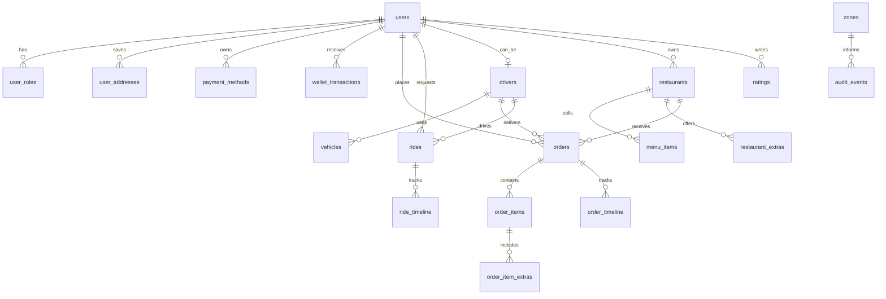

# Arquitectura de producto

Flash Delivery Mobility esta organizada como una plataforma multirol:

- Cliente: comida, taxi, actividad, wallet y perfil.
- Comercio: cocina, stock, estado operativo y alta de productos.
- Driver: conductor y repartidor en la misma app.
- Ops: operaciones, soporte, metricas y control de estados.

## Stack actual

- Frontend: React, Vite, TypeScript y CSS responsive.
- Backend: Express.
- Base de datos: SQLite con `better-sqlite3`.
- Auth: bcrypt para passwords, JWT para sesion y RBAC inicial por rol.
- Validacion: `zod` en endpoints criticos.
- Seguridad HTTP: Helmet, CORS con allowlist y rate limiting.
- Operacion: request IDs, logs estructurados, health y readiness.

## Diagrama de dominio

## API principal

- `GET /api/health`: salud del backend y path de SQLite.
- `GET /api/ready`: readiness del backend y lectura basica de base.
- `GET /api/state`: estado de app protegido por JWT.
- `POST /api/auth/login`: login con password hasheado y JWT.
- `POST /api/auth/register`: registro de cliente.
- `GET /api/restaurants`: catalogo.
- `PATCH /api/restaurants/:restaurantId`: abrir/pausar local y ETA.
- `POST /api/restaurants/:restaurantId/menu`: crear producto.
- `PATCH /api/restaurants/:restaurantId/menu/:itemId`: stock y precio.
- `POST /api/orders`: crear pedido.
- `POST /api/orders/:orderId/accept-delivery`: aceptar delivery.
- `POST /api/orders/:orderId/advance`: avanzar estado.
- `PATCH /api/orders/:orderId/status`: correccion/cancelacion.
- `POST /api/rides/quote`: cotizar taxi.
- `POST /api/rides`: crear viaje.
- `POST /api/rides/quote`: cotizar por coordenadas cuando estan disponibles y conservar fallback por texto.
- `POST /api/rides/:rideId/accept`: aceptar viaje.
- `POST /api/rides/:rideId/advance`: avanzar viaje.
- `PATCH /api/drivers/:driverId/availability`: online/offline y modo.
- `PATCH /api/drivers/:driverId/location`: actualizar posicion GPS del propio driver.
- `POST /api/reset`: reset de datos demo.

## Seguridad aplicada

Las rutas sensibles requieren `Authorization: Bearer <token>`.

- `admin`: puede consultar dashboard/metricas, intervenir estados y reiniciar demo.
- `merchant`: puede modificar solo el restaurante que posee.
- `driver`: puede cambiar solo su disponibilidad, aceptar trabajos propios y avanzar trabajos asignados.
- `customer`: puede crear pedidos/viajes solo para su usuario y cancelar solicitudes propias.

Cada mutacion importante escribe un evento en `auditEvents` con actor, entidad, accion y fecha.

El servidor agrega `X-Request-Id` a cada respuesta, limita abuso por ventana de tiempo y restringe origenes CORS desde configuracion. En produccion no arranca con el secreto JWT demo.

## Decisiones

La app usa SQLite para que sea real y portable en local. En produccion, el mismo modelo deberia moverse a Postgres con migraciones versionadas, indices geoespaciales, colas de eventos y WebSockets.

El frontend consume una API unica. Esto permite reemplazar la base local por servicios reales sin reescribir la experiencia del usuario.

La sesion actual usa cuentas demo, pero la proteccion vive en servidor: JWT, roles, ownership y auditoria. Para produccion faltan refresh tokens, rotacion de sesiones, rate limiting, MFA para superadmin y politicas finas de permisos.

La plataforma ya acepta coordenadas, calcula distancia geodesica inicial y recibe posiciones foreground de drivers. El siguiente paso productivo es conectar geocoding, calculo de ruta vial con un proveedor, tracking background controlado y mapas nativos.
