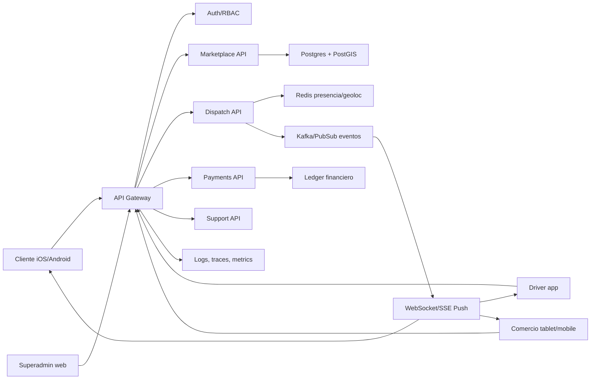

# Infraestructura escalable

Fecha: 14 de agosto de 2026.

## Principio de producto

Flash debe tener dos superficies:

- Apps mobile para cliente, comercio y conductor/repartidor.
- Web de escritorio solo para superadministrador y gestion de plataforma.

La implementacion actual respeta esa separacion en el navegador: viewport desktop muestra la consola `Flash Command`; viewport mobile muestra la app. Para produccion, el camino recomendado es migrar la experiencia mobile a Expo/React Native y mantener la web solo como backoffice.

## Fuentes tecnicas usadas

- AWS Well-Architected Operational Excellence: https://docs.aws.amazon.com/wellarchitected/latest/operational-excellence-pillar/welcome.html
- AWS Well-Architected Reliability: https://docs.aws.amazon.com/wellarchitected/latest/reliability-pillar/welcome.html
- Kubernetes Horizontal Pod Autoscaler: https://kubernetes.io/docs/concepts/workloads/autoscaling/horizontal-pod-autoscale/
- Uber Real-Time Push Platform: https://www.uber.com/us/en/blog/real-time-push-platform/
- Uber real-time data infrastructure paper: https://arxiv.org/abs/2104.00087
- DoorDash dispatch optimization: https://careersatdoordash.com/blog/using-ml-and-optimization-to-solve-doordashs-dispatch-problem/
- Expo EAS Build: https://docs.expo.dev/build/introduction/
- Apple App Review Guidelines: https://developer.apple.com/app-store/review/guidelines/
- Android Trusted Web Activities: https://developer.android.com/develop/ui/views/layout/webapps/trusted-web-activities
- OWASP API Security Top 10 2023: https://owasp.org/API-Security/editions/2023/en/0x11-t10/

## Arquitectura objetivo

## Fases recomendadas

Fase 1, MVP serio (completada en runtime local):
- Mantener Express con PostgreSQL/PostGIS reproducible; SQLite sólo para pruebas fallback.
- PWA instalable para pruebas internas.
- Docker Compose para entorno reproducible.
- JWT, bcrypt, validacion de payloads y superadmin desktop.

Fase 2, beta cerrada:
- [x] Migrar el runtime principal de SQLite a PostgreSQL.
- [x] Agregar PostGIS para búsqueda geoespacial.
- Redis para presencia de drivers, locks de asignacion y cache.
- WebSockets o SSE para tracking, chat y ofertas.
- Worker de dispatch separado de la API.
- Integrar Mercado Pago/Stripe, mapas y push notifications.

Fase 3, escala regional:
- Separar dominios en servicios: identity, marketplace, dispatch, payments, support, notifications, admin.
- Event bus con Kafka, Redpanda o Pub/Sub.
- Kubernetes con Horizontal Pod Autoscaler.
- Observabilidad con OpenTelemetry, Prometheus/Grafana y Sentry.
- Feature flags, experimentacion A/B, simulador de demanda y antifraude.

## Modelo de datos productivo

El schema local ya prepara entidades centrales: usuarios, roles, direcciones, pagos, wallet, restaurantes, horarios, menu, extras, pedidos, timelines, drivers, vehiculos, viajes, promociones, soporte, ratings, zonas y auditoria.

Para produccion:
- Postgres como fuente de verdad transaccional.
- PostGIS para drivers cercanos, zonas y ETA.
- Redis GEO para ubicacion viva de drivers/repartidores.
- Ledger inmutable para pagos, comisiones, reintegros, ajustes y liquidaciones.
- Audit log append-only aplicado físicamente con privilegios mínimos, trigger y contexto de mantenimiento exclusivo de migraciones.

## Seguridad

OWASP API Security Top 10 2023 marca como riesgos principales autorizacion por objeto, autenticacion rota, autorizacion por propiedad y consumo no controlado de recursos. Para Flash:

- RBAC por rol y permiso: customer, merchant, driver, support, ops, superadmin.
- Validar ownership en cada accion: un comercio no puede tocar otro comercio, un driver no puede avanzar viajes ajenos.
- Rate limiting por IP, usuario y flujo sensible.
- Refresh tokens rotativos, revocacion de sesiones y MFA para superadmin.
- Secrets en gestor dedicado, no en variables hardcodeadas.
- Auditoria obligatoria para cambios de estado, pagos, reembolsos, suspensiones y configuracion.

## Operacion

AWS Well-Architected enfatiza operar, observar y evolucionar cargas de trabajo de forma continua. La plataforma debe tener:

- SLOs por flujo: cotizacion, creacion de pedido, asignacion, tracking y pagos.
- Alertas: backlog de dispatch, baja oferta de drivers, error rate, pagos rechazados, latencia p95.
- Runbooks: caida de pagos, saturacion de cocina, zona sin drivers, abuso promocional.
- Deploy blue/green o canary.
- Backups automaticos, restauracion probada y migraciones versionadas.

## Mobile real

La PWA actual sirve para validar producto. Para competir en stores:

- Expo/React Native con EAS Build para generar binarios iOS/Android.
- Navegacion nativa, geolocalizacion foreground/background, push notifications, camara/documentos para onboarding de drivers, biometria y deep links.
- Apple exige que las apps tengan funcionalidad y experiencia suficiente, no ser solo una web empaquetada.
- Android permite Trusted Web Activities para PWA, pero para driver tracking y background location conviene nativo.
